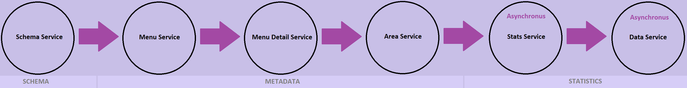
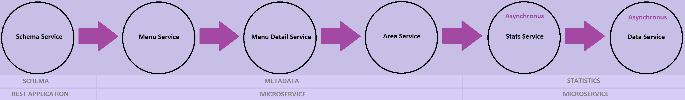

## Problem
We had a service which was receiving a large number of requests. That service was capable of handling requests and respond the caller according to provided input (JSON/XML). However due to hassles of concurrency and some other factors in the older technology, it was becoming harder to maintain, extend and support.

## Requirements
The Old service required a unique identifier and a schema name on which it would return all the defined statistics.
This required the application to run tons of queries on the Database resulting in slow performance

## Solution
I wrote this prototype initially as a proof of concept that we can achieve multi-threading using **Java 8 Concurrency API** along with **Spring Boot** to maintain, support, extend the development processes, and how fast results could be achieved using this tech stack

**Note: For the sake of simplicity, no entity relations are defined, each entity is queried separately through its service and then procesed.**

### Tech Stack
* Java 8
* Spring Boot 2.7.7
* Spring Data JPA + Hibernate + H2 + HikariCP
* Thymeleaf
* EhCache 3
* AspectJ + JMonitor + Actuator
* Maven 3.8.6

## Working
Statistic Definitions are stored in Table **CENSUS**, currently it has sample data of census 2017 from **Karachi, Pakistan**

* Table **menu** is the wrapper over **Census** Table
* Table **menu_detail** would contain MenuTitle or Description or extra information related to **menu**
* Table **stats_builder** would contain query building definition with addition of user & required filters, aggregation, etc
* Table **menu_stats_mapping** is just a mapping between Menu Table & Stats Table

In short, the above structure would allow to build a custom wrapper over Census Table by User definition and get Statistics accordingly
For Example: The test data contain entries for the following data request:

```
curl --request POST \
  --url http://localhost:8081/app/schema/get \
  --header 'Content-Type: application/json' \
  --header 'accept: application/xml' \
  --data '{
	"org": "0001",
	"key": "censusk17"
}'
```


So, the current business logic goes as:




## Cache

Application is configured to create cache for the following entries:
* `MenuCache`
* `MenuDetailCache`
* `AreaCache`
* `StatsCache`

Results generated by census query will not be cached.

There is an endpoint to clear above caches:
```
curl --request GET \
  --url 'http://localhost:8081/app/schema/cache/clear?name=MenuCache'
```
**Note: If you exclude the name parameter, all application caches would be cleared**

Feel free to extend/modify according to your needs

## Roadmap


~~After completion of this project, I have planned to move it to micro-service architecture by splitting the **Metadata** and **StatsBuilder + Execution** into separate micro-services~~

I have uploaded the microservice version in branch ``microservice-arch``

In micro-service architecture the application Flow is divided as:



**Note:** More information regarding microservices will be updated in branch's [README](https://github.com/usama28232/statistics-wrapper/blob/microservice-arch/README.md)

---------------------------------------

## Application Structure
Application is divided into 3 modules:

- `BASE` Contains core/basic classes, DTOs, enums, interface, base controllers, base services
- `REST` Contains Rest Enpoints, handles Request/Response
- `SUMMARY` Contains JMeter & custom logging to monitor each Thread in/out/toal durations 

## Configuration

All properties are defined in `application-core.properties` file:

### Environment Configuration
````
# ENV
app.org=0001
app.user=dev
````

### Thread Configuration
````
# thread config
app.core.thread.pool.size=30
app.max.thread.pool.size=0
app.thread.queue.size=0
````

### Connection Pool

````
# HikariCP settings
spring.datasource.hikari.minimumIdle=15
spring.datasource.hikari.maximumPoolSize=30
spring.datasource.hikari.idleTimeout=30000
spring.datasource.hikari.maxLifetime=2000000
spring.datasource.hikari.connectionTimeout=300000
spring.datasource.hikari.poolName=AppAPIPool
````

### Server Config
````
# Server Configs
server.port=8081
server.servlet.context-path=/app
server.error.path=/error
server.error.include-exception=true
server.error.include-stacktrace=on_param
````


### Feel free to edit/expand/explore this repository

For feed back and queries, reach me on Linkedin at [here](https://www.linkedin.com/in/usama28232/?original_referer=)