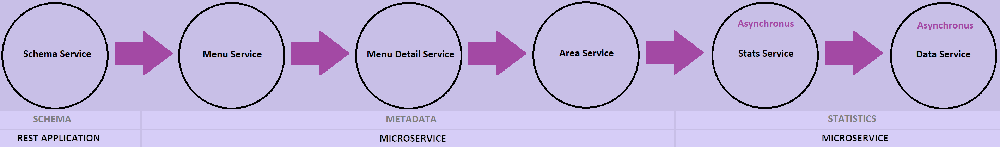

## Project Structure
Previously, we had 3 Modules `base`, `summmary` and `rest`

`base` and `summary` were just supporting modules and `rest` contained the application 

I had to make some changes to convert this into microservice architecture, the new project structure is as follows:

* `discovery-server`
* `rest-application`
* `menu-application`
* `stats-application`

`base` and `summary` module are serving the same purpose as before

If you have not read the goal/reason of this experiment, please refer to [this](https://github.com/usama28232/statistics-wrapper/wiki/Statistics-Wrapper-Application) wiki section.

### Discovery Server
I am using **Eureka** as the discovery server. Its configuration is defined in `application-discovery.properties`

```
server.port=1111
eureka.instance.hostname=localhost
eureka.client.register-with-eureka=false
eureka.client.fetch-registry=false
```

**Note:** Eureka by default comes with Freemaker templates, I have disabled it so there is no visual dashboard

To list all registered applications in Eureka: http://localhost:1111/eureka/apps

## Working

The `rest-application` will serve as application-front and user would send request to this part. It is connected to Eureka Server but not registered as a microservice.
It just consists of a single controller and a service which sends request to `menu-applcation`

`menu-application` (microservice) will construct the metadata according to received `org` and `key` and forward the request to `stats-application`

`stats-application` (microservice) will build the query dynamically and execute the statistics to send results back to the caller.

Perhaps the following image will illustrate a more simplified division of this approach.



Following is a sample request:

```
curl --request POST \
  --url http://localhost:8081/app/schema/get \
  --header 'Content-Type: application/json' \
  --header 'accept: application/xml' \
  --data '{
	"org": "0001",
	"key": "censusk17"
}'
```

**Note:** Inter-application communication is also carried out in REST APIs

---

## Conclusion

In [previous implementation](https://github.com/usama28232/statistics-wrapper) there was no way of managing the resource pools (like thread, connections) individually. I was asked in one presentation that if we could manage the resources separately for metadata construction and statistics execution, but it was not possible in the previous approach

Hence, most of the cache mechanism are living in the metadata there is no need to share a huge resource pool with it. With this approach we can separate the resource pools for each application.

We can also add some messaging queue between the applications to make up for down-time and prevent data loss

Also, there is a load balancing mechanism (provided **Netflix Ribbon**) which can route the request to another instance of a microservice in case of overload


### Feel free to edit/expand/explore this repository

#### For feed back and queries, reach me on [LinkedIn](https://www.linkedin.com/in/usama28232/) at here
